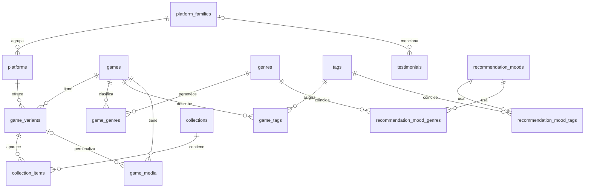

# ROCK GAMES — arquitectura propuesta para SSR y Supabase

Estado: arquitectura aprobada; esquema y repositorios JSON/Supabase implementados. Tres migraciones aplicadas al proyecto remoto enlazado. Sin Auth/CMS ni SSR productivo.

### Estado de esta fase

- Implementado: contratos, modelos de vista, interfaz de repositorio, adaptadores JSON/Supabase y selección explícita `DATA_SOURCE=json|supabase`.
- Migradas: `/`, `/catalogo` y `/como-funciona`; ninguna depende de `getSiteContent()` ni del antiguo `src/lib/catalog.ts`.
- La wishlist mantiene su clave/formato actual de `localStorage`; JSON usa las claves anteriores y Supabase usa el UUID de variante. No se migran automáticamente claves antiguas.
- SSR queda preparado pero pospuesto: todavía no hay proveedor de despliegue elegido ni adapter instalado. `astro.config.mjs` conserva la salida estática para mantener válido el build del hosting actual. Al elegir el host, instalar su adapter antes de activar `output: "server"`.
- Las migraciones implementan entidades, enums, constraints, índices, triggers, RLS de solo lectura para `anon`, el bucket público `public-media` y datos base sin inventario.
- `supabase/seed.sql` incluye solo fichas `(DEMO)`, precios de prueba y cero testimonios. Los medios apuntan a artes locales con `bucket=local-assets`, no a objetos ya subidos.
- La inspección y las pruebas remotas se ejecutaron con el proyecto linked; Docker Desktop sigue sin daemon local. El CLI temporal no se agregó como dependencia.
- Supabase falla explícitamente ante credenciales o consultas faltantes; nunca recurre a JSON.

### Validación remota del 4 de octubre de 2026

- Historial remoto y local alineado: `20261004120000`, `20261004130000`, `20261004140000`.
- 17 tablas públicas, 17 con RLS; cuatro enums; 17 políticas SELECT y cero políticas públicas de escritura. Anon no tiene grants de escritura sobre las tablas del catálogo.
- Pruebas con publishable key: SELECT OK en 17 tablas; INSERT/UPDATE/DELETE en `games` rechazados con `42501`.
- Storage: bucket `public-media` público. Lectura de objeto temporal `200`; upload y update anon `403`. DELETE anon respondió con lista vacía, sin borrar el objeto. El REVOKE de la segunda migración no alteró los grants de `storage.objects` otorgados por `supabase_storage_admin`; RLS sin políticas de escritura impidió la mutación. Esta semántica de respuesta debe considerarse al validar Storage.
- Ficha temporal: un juego, variantes PS5 y Xbox Series con IDs y precios distintos. El catálogo, filtros, wishlist persistente y texto de WhatsApp se revisaron en navegador. Cambiar precio remoto de 10 a 11 se reflejó al recargar desarrollo. Precio y ficha restaurados/retirados; cero filas de prueba restantes.
- Seed DEMO no aplicado porque no está confirmado que el proyecto remoto sea solo de desarrollo. Quedan los datos base y ningún producto comercial.

## 1. Estado actual y decisión de SSR

- Astro instalado: 7.3.5. `astro.config.mjs` no declara `output` ni adapter; el sitio se genera de forma estática.
- No existe `export const prerender` en las páginas. Las rutas `/`, `/catalogo` y `/como-funciona` se prerenderizan por el valor predeterminado de Astro.
- `getSiteContent()` importa `src/data/site.json`. React recibe ese contenido como props en `client:load`; la hidratación no convierte el origen de datos en dinámico.
- README describe publicación en cualquier host estático. No hay configuración de Vercel, Netlify, Cloudflare, Node u otro proveedor. El destino de despliegue no se puede inferir.

**Objetivo condicionado de SSR:** cuando se confirme el host, el destino podrá usar `output: "server"` y las tres rutas podrán renderizarse en servidor, porque consumen configuración o productos editables. Astro necesita un adapter para generar un build SSR. No activar `output: "server"` sin adapter: dejaría el build de producción sin runtime. La arquitectura de datos es independiente del adapter. Al elegir hosting, instalar el adapter oficial correspondiente: `@astrojs/node` en modo standalone para un servidor Node, o el de Vercel, Netlify o Cloudflare si ese es el host. Hasta entonces, esta fase conserva el build estático funcional y no presupone proveedor.

No habrá `prerender = true` en rutas que consulten datos editables. Los assets optimizados seguirán siendo estáticos. Al principio, catálogo y precios usarán respuesta sin caché compartida; luego se podrá añadir una caché corta o invalidación desde el CMS. La meta es reflejar cambios sin rebuild, no prometer visibilidad instantánea si más adelante se configura caché.

## 2. Modelo relacional



**Nombre elegido: `game_variants`.** Una misma combinación juego/consola puede tener ediciones distintas, por ejemplo Estándar y Deluxe. `game_platforms` sugiere una única fila por pareja juego/plataforma. La variante es la unidad vendible, con ID estable para wishlist, precio y disponibilidad. La información común permanece en `games`.

### Tablas y campos

| Tabla | Campos propuestos | Claves y restricciones |
| --- | --- | --- |
| `platform_families` | `id uuid`, `slug text`, `name text`, `sort_order int`, `is_active bool` | PK `id`; UNIQUE `slug`. Semillas: PlayStation, Xbox, Nintendo. |
| `platforms` | `id uuid`, `family_id uuid`, `slug text`, `name text`, `sort_order int`, `is_active bool` | PK `id`; FK `family_id`; UNIQUE `slug`. Semillas: PS4, PS5, Xbox One, Xbox Series X|S, Nintendo Switch, Nintendo Switch 2. |
| `games` | `id uuid`, `slug text`, `title text`, `short_description text`, `description text`, `is_published bool`, `created_at timestamptz`, `updated_at timestamptz` | PK `id`; UNIQUE `slug`. Sin precio ni plataforma. |
| `game_variants` | `id uuid`, `game_id uuid`, `platform_id uuid`, `version_key text`, `version_label text`, `price numeric(10,2) null`, `compare_at_price numeric(10,2) null`, `availability availability_status`, `release_date date null`, `new_until timestamptz null`, `stock_quantity int null`, `is_active bool`, `created_at timestamptz`, `updated_at timestamptz` | PK `id`; FK `game_id` y `platform_id`; UNIQUE `(game_id, platform_id, version_key)`; precios y stock no negativos. `version_key` estable evita problemas de UNIQUE con un label opcional. |
| `genres` | `id uuid`, `slug text`, `name text`, `sort_order int`, `is_active bool` | PK `id`; UNIQUE `slug`. |
| `game_genres` | `game_id uuid`, `genre_id uuid`, `is_primary bool`, `sort_order int` | PK `(game_id, genre_id)`; dos FK. Máximo un género primario por juego. |
| `tags` | `id uuid`, `slug text`, `name text`, `is_active bool` | PK `id`; UNIQUE `slug`. Rasgos como `story`, `narrative`, `multiplayer`, `coop`, `open-world`. |
| `game_tags` | `game_id uuid`, `tag_id uuid` | PK `(game_id, tag_id)`; dos FK. |
| `collections` | `id uuid`, `slug text`, `name text`, `type collection_type`, `is_active bool`, `start_at timestamptz null`, `end_at timestamptz null`, `sort_order int`, `created_at timestamptz`, `updated_at timestamptz` | PK `id`; UNIQUE `slug`; si ambas fechas existen, `end_at > start_at`. `type` distingue ubicación fija de campaña, no repite el slug. |
| `collection_items` | `collection_id uuid`, `game_variant_id uuid`, `position int` | PK `(collection_id, game_variant_id)`; dos FK; UNIQUE `(collection_id, position)`. Reordenar en una transacción. |
| `recommendation_moods` | `id uuid`, `slug text`, `label text`, `sort_order int`, `is_active bool`, `platform_family_id uuid null`, `max_price numeric(10,2) null`, `sort_mode recommendation_sort`, `max_results int` | PK `id`; UNIQUE `slug`; FK opcional a familia. `max_results` inicia en 3. |
| `recommendation_mood_tags` | `mood_id uuid`, `tag_id uuid` | PK compuesta; dos FK. |
| `recommendation_mood_genres` | `mood_id uuid`, `genre_id uuid` | PK compuesta; dos FK. |
| `testimonials` | `id uuid`, `alias text`, `text text`, `platform_family_id uuid null`, `source text null`, `date date null`, `rating smallint null`, `consented_at timestamptz null`, `published bool default false`, `sort_order int`, `created_at timestamptz` | PK `id`; FK opcional; rating entre 1 y 5; una fila publicada exige consentimiento. Sin teléfono ni identidad privada. |
| `site_settings` | `id smallint`, `brand_name text`, `country char(2)`, `currency char(3)`, `logo_path text null`, `whatsapp_number text null`, `facebook_url text null`, `youtube_url text null`, `email text null`, `analytics_id text null`, `updated_at timestamptz` | PK `id` restringida a valor 1: tabla de una fila, con campos tipados. Sin secretos. |
| `site_sections` | `id uuid`, `key text`, `eyebrow text null`, `title text null`, `highlighted_text text null`, `description text null`, `media_path text null`, `poster_path text null`, `media_alt text null`, `cta_label text null`, `cta_url text null`, `is_visible bool`, `sort_order int`, `updated_at timestamptz` | PK `id`; UNIQUE `key`; whitelist de claves en la capa de datos/CMS. El componente y layout siguen en código. |
| `game_media` | `id uuid`, `game_id uuid`, `game_variant_id uuid null`, `bucket text`, `storage_path text`, `role media_role`, `alt_text text null`, `sort_order int` | PK `id`; FK de juego y variante; UNIQUE `(bucket, storage_path)`. Si hay variante, exigir mediante FK compuesta que pertenezca al juego indicado. |

`site_sections.key` usa estas claves controladas: `hero`, `platforms`, `featured`, `best_sellers`, `offers`, `upcoming`, `how_it_works`, `trust`, `testimonials`, `final_cta`. El CMS edita el encabezado, medios, CTA, orden y visibilidad de esos componentes predefinidos. Las tarjetas proceden de colecciones, juegos o testimonios; no se guardan estructuras de layout arbitrarias. El hero usa `media_path` para video y `poster_path` para imagen de respaldo. El título del juego de la campaña se obtiene del primer item de la colección correspondiente, evitando copiarlo a mano.

### Índices

- FK: índices en `platforms.family_id`, `game_variants.game_id`, `game_variants.platform_id`, `collection_items.game_variant_id`, `game_media.game_id` y `game_media.game_variant_id`.
- Catálogo: índice combinado de `game_variants(platform_id, is_active, availability)` y en `games(is_published)`. Índice por `release_date` cuando la sección Próximamente lo necesite.
- Orden editorial: UNIQUE `(collection_id, position)` cubre la consulta ordenada dentro de cada colección.
- Búsqueda: empezar con índice de título/slug apropiado para búsqueda parcial en PostgreSQL cuando el catálogo crezca; con nueve juegos no hace falta motor externo.
- Join tables: PK compuesta y un índice inverso por la segunda FK si se consulta desde el género/tag.
- Testimonios y secciones: índices para `(published, sort_order)` y `(is_visible, sort_order)` respectivamente.

### Enums propuestos

- `availability_status`: `upcoming`, `preorder`, `available`, `unavailable`. `is_active` y `games.is_published` controlan publicación por separado.
- `collection_type`: `placement`, `campaign`. Los slugs fijos (`featured`, `best-sellers`, `featured-offers`, `recommended`, `upcoming`) identifican cada ubicación; campañas de temporada pueden crear otros slugs.
- `media_role`: `cover`, `hero`, `gallery`, `poster`, `video`.
- `recommendation_sort`: `editorial`, `price_asc`, `newest`.

No enum para `source` de testimonio: pueden aparecer nuevas fuentes. `site_sections.key` queda como unión TypeScript y validación de claves permitidas; nuevas secciones requerirán código y cambio deliberado del contrato.

### Estados y colecciones

Las colecciones sustituyen `featured`, `bestsellerIds`, `is_best_seller` e `is_recommended` como flags dispersos. En portada, Más vendidos, Ofertas destacadas, Recomendados y Próximamente son colecciones con items ordenados. Una colección solo se muestra si está activa y dentro de su ventana temporal; cada item debe apuntar a una variante activa de un juego publicado.

`offer` se deriva de `compare_at_price > price`. La colección Ofertas destacadas decide cuáles ofertas aparecen en home. `upcoming` y `preorder` son disponibilidad de variante; la colección Próximamente selecciona qué lanzamientos promover. `new` se muestra mientras `new_until` no haya vencido; el CMS controla la fecha. No guardar un único `tag` excluyente. El badge que muestra una tarjeta se decide con una prioridad de presentación definida en código.

## 3. Recomendador determinista

Cada opción del recomendador define tags, géneros, un límite opcional de precio, una familia opcional y un orden. Dentro de tags o géneros se permite coincidencia con cualquiera; precio y familia restringen los candidatos. Se consideran solo variantes activas, disponibles y de juegos publicados. Se deduplica por juego cuando varias variantes cumplen, eligiendo la variante más adecuada al filtro, y se aplica un desempate estable por título e ID. `price_asc` sirve para presupuesto. Sin IA y sin un segundo catálogo duplicado.

## 4. Medios y Storage

- `public-media`: solo objetos aprobados para publicación. Un bucket público permite descarga directa a quien posea la URL, por lo que **no** contendrá borradores. Escritura solo desde usuarios CMS autorizados.
- `private-drafts`: uploads en revisión; descarga y escritura solo para administradores autorizados. Al publicar, copiar el archivo aprobado a `public-media` y actualizar la ruta en la BD.
- En PostgreSQL se guardan `bucket` y `storage_path`, no binarios ni URLs firmadas. El adaptador construye la URL pública. Para thumbnails se usa transformación/resizing del cover; no se crea una segunda imagen por obligación.
- `game_media` alberga cover, hero y galería opcional. `site_sections` referencia poster y video del hero. Limitar MIME/tamaño en cada bucket y optimizar video e imágenes antes de servirlos.

## 5. RLS y clientes

La lectura pública usará un cliente Supabase con clave publicable/anon y políticas RLS. La página SSR puede usar esa misma identidad pública para obtener contenido; no necesita clave privilegiada. Un cliente de navegador será opcional y se reservará para interacciones públicas que de verdad requieran consultas desde el cliente. No habrá queries Supabase dentro de cada componente visual.

La separación de módulos será explícita: `public-browser.ts` solo acepta variables `PUBLIC_` y ejecuta lecturas permitidas por RLS; `public-server.ts` vive en la capa server-only y consulta contenido público durante SSR; `admin-server.ts` se añadirá con el CMS, sesión autenticada y políticas de escritura. Ese cliente administrativo usará la identidad de la persona autorizada, no una clave con bypass de RLS. Una eventual clave privilegiada quedará en otro módulo exclusivo para mantenimiento del servidor y no participará en peticiones públicas ni en props hidratadas. Cuando exista Auth en SSR, su sesión se manejará con cookies y la integración SSR correspondiente.

Variables previstas: `PUBLIC_SUPABASE_URL` y `PUBLIC_SUPABASE_ANON_KEY` como pidió el proyecto. Supabase recomienda las claves publicables nuevas; se podrá renombrar a `PUBLIC_SUPABASE_PUBLISHABLE_KEY` antes de conectar el proyecto. La clave publicable no es un secreto, pero solo debe acceder a lo permitido por grants y RLS. `SUPABASE_SECRET_KEY` sería server-only y solo si una tarea de mantenimiento futura necesita privilegios; no se requiere para las lecturas públicas. Nunca enviar una clave secret/service_role al navegador ni a props serializadas.

Políticas conceptuales:

- Público (`anon`): SELECT de familias/plataformas activas, juegos publicados, variantes activas, géneros y tags expuestos, colecciones activas y vigentes con items visibles, secciones visibles, configuración pública y testimonios `published = true` con `consented_at` presente. Ninguna escritura pública.
- CMS (`authenticated`): escritura solo para cuentas incluidas en una futura lista de administradores/roles verificada por `auth.uid()` y políticas específicas. La tabla de miembros del CMS se diseñará con Auth, sin basar autorización en datos editables por el propio usuario.
- Storage: lectura libre de objetos ya publicados en `public-media`; acceso a `private-drafts` solo con credenciales de CMS. Subir, mover y borrar requieren políticas restrictivas para admins.
- Revisar también GRANTs del esquema público. RLS y privilegios de tabla son controles complementarios. Un borrador no debe quedar accesible mediante una relación, vista o bucket público.

## 6. Capa de acceso y tipos

Estructura propuesta:

```text
src/lib/data/
  contracts.ts             # Game, GameVariant, PlatformFamily, Platform,
                           # Genre, Tag, Collection, CollectionItem,
                           # Testimonial, SiteSettings, SiteSection
  view-models.ts           # CatalogCard, FeaturedCard, HomePortal, SitePageData
  repository.ts            # interfaz y funciones getGames, getGameBySlug,
                           # getCollections, getSiteSettings, getTestimonials,
                           # getGenres, getPlatforms, getSections
  json-repository.ts       # adaptador temporal del site.json
  supabase-repository.ts   # adaptador implementado, solo server
  index.ts                 # selección explícita de origen
```

Los tipos de fila de PostgreSQL se generarán tras aprobar el esquema y permanecerán separados de los tipos de dominio y de vista. Un `Game` contiene los datos comunes; `GameVariant` contiene consola, versión, precio y disponibilidad. `CatalogCard` reúne un juego con sus variantes visibles. En la UI se elegirá consola/versión antes de guardar; el ID almacenado será el de variante.

`getHomePageData()` puede componer las consultas necesarias de manera concurrente para SSR y evitar consultas repetidas por componente. Las páginas leen el repositorio y entregan DTO serializables a React. Las reglas de filtrado/formatos no dependerán de la respuesta cruda de Supabase.

Durante transición, `DATA_SOURCE=json|supabase` seleccionará explícitamente el proveedor. El JSON es fallback temporal por fase, no respuesta silenciosa ante un error de BD en producción: mostrar precios antiguos cuando Supabase falla sería engañoso. Al finalizar migración, quitar `json-repository.ts`, `site.json` y `DATA_SOURCE=json`.

## 7. Wishlist local

Se conserva `localStorage` y la ausencia de cuentas. Hoy `rockgames:selected` guarda IDs de juego porque cada juego tiene una sola plataforma. El nuevo formato guardará IDs estables de `game_variants`, resolviendo juego, consola, edición y precio vigente al mostrar el panel. El precio no se congela en localStorage. La migración del formato viejo podrá mapear un ID de juego a una variante única; si hay varias opciones, pedirá seleccionar consola antes de agregarlo. Los IDs desconocidos se descartan o se presentan como no disponibles, sin romper el panel.

## 8. Migración y efecto en componentes

1. Elegir hosting/runtime, instalar su adapter y activar `output: "server"`. Mantener `site.json` como fuente explícita y verificar que las tres rutas SSR conservan contenido e hidratación. Esta fase no requiere Supabase.
2. Implementar contratos, view models y repositorio JSON. La UI sigue leyendo datos locales, ahora detrás de la capa de acceso.
3. Tras aprobar el esquema, crear plataformas/familias, juegos y variantes; mapear los IDs existentes a slugs/UUID estables. Separar PS4/PS5 y Xbox One/Series X|S solo con información comercial confirmada.
4. Incorporar géneros, tags y reglas del recomendador. Comprobar que los resultados siguen siendo coherentes.
5. Incorporar colecciones y secciones; migrar En portada, Más vendidos, ofertas y Próximamente, sin promocionar los placeholders conceptuales como lanzamientos reales.
6. Configurar settings públicos, testimonios reales y Storage. Publicar testimonios solo tras consentimiento.
7. Cambiar el repositorio activo a Supabase y verificar home, catálogo, filtros, búsqueda, precios, enlace WhatsApp y wishlist por variante. Un fallo de BD debe producir estado de error apropiado, no precios estáticos viejos.
8. Quitar JSON y código de transición. Construir CMS después, con Auth/RLS de escritura y validación de formularios.

Impacto esperado: `Catalog.tsx`, `ProductPoster.tsx`, `FeaturedShowcase.tsx` y `GameFinder.tsx` deberán aceptar variantes y seleccionar una antes de usar precio o wishlist. `EditorialSections.astro` leerá colecciones y testimonios; `HeroScroll.astro` y `SiteLayout.astro` leerán secciones/settings. `platforms.ts` conservará los colores e iconos de presentación, mientras nombres/relaciones de consola vendible saldrán del repositorio. Las páginas Astro pasarán de `getSiteContent()` a los métodos de la capa de datos.

## 9. Riesgos y decisiones pendientes

- Sin host definido no se puede escoger un adapter de despliegue definitivo. Activar SSR sin adapter rompería el build.
- Las fichas actuales asumen una plataforma/precio por juego. Se necesita diseño de selección de variante en card, filtro, En portada y wishlist.
- Los nueve precios y artes son de muestra; no migrarlos como inventario listo para vender sin revisión comercial y derechos de uso.
- El ranking actual y el filtro de Más vendidos discrepan. Las colecciones harán explícita la única selección editorial.
- Los cambios en CMS se reflejarán sin rebuild; una caché CDN demasiado larga podría retrasarlos. Precios y disponibilidad exigen política de caché clara.
- SSR agrega un servidor público que antes no existía. Antes de producción hay que revisar dependencias, límites de consulta, timeouts y comportamiento ante caída de Supabase.
- No hay pagos ni control real de stock. `stock_quantity` es opcional hasta definir inventario de códigos; no presentar compra directa por un estado de BD no verificado.

## 10. Referencias técnicas

- Astro: https://docs.astro.build/en/guides/on-demand-rendering/
- Adapter Node de Astro: https://docs.astro.build/en/guides/integrations-guide/node/
- Supabase, claves y acceso: https://supabase.com/docs/guides/getting-started/api-keys
- Supabase, RLS: https://supabase.com/docs/guides/database/postgres/row-level-security
- Supabase, buckets públicos y privados: https://supabase.com/docs/guides/storage/buckets/fundamentals
